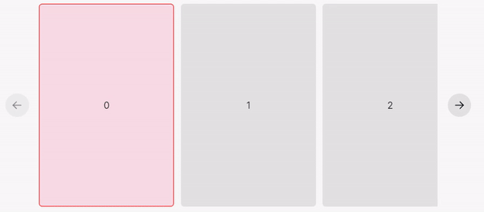

# Carousel Child Props

All children of the Carousel component _must_ use the `CarouselChildProps`, or a React error will occur. These props supply information about the state of each child.

`isNearest` describes whether this child is the nearest to the left edge of the carousel, but is not necessarily the same as the "active" child. `isActive`, conversely, describes whether this child is focused by the carousel. When the user is moving the carousel (either via scrolling or dragging), both the nearest and active components are likely to be the same; the active component is usually the one that is closest to the left edge.

When scrolling all the way to the right, these two values diverge. The nearest child will always be the element closest to the left edge, however the active child may become one that is further right than the nearest one.

Additionally, the active child is "debounced" such that it does not change as frequently when scrolling.

**In short, in almost every situation, you should prefer the use of `isActive` over `isNearest`. The latter is included for completeness.**

<figure><figcaption>
In this example, the outline child is the nearest, and the pink one is active.
</figcaption></figure>
